# Dynamics of Structures under Moving Loads, Part B
## Problem 1: Hyperloop on Periodic Supports

**Course:** CIEM5220

---

## Introduction

For Part B we chose Problem 1, which asks us to model the hyperloop as an infinite Euler-Bernoulli
beam resting on discrete, periodically spaced elastic supports, and to study it with one analytical
model and one finite element model in ANSYS Mechanical APDL. The four sub-questions build on each
other. In (a) we derive the analytical dispersion relation, in (b) we reproduce the dispersion
numerically in ANSYS and compare the two, in (c) we determine the critical velocity and verify it
with moving-load time-domain simulations, and in (d) we discuss how the support stiffness affects
the critical velocity.

All parameters are taken from the assignment Appendix:

| Symbol | Value | Quantity |
|---|---|---|
| $EI$ | $2.5\times10^{10}$ Nm² | bending stiffness ($E$ with $I=1$) |
| $\rho$ | 1330 kg/m | mass per unit length ($A=1$) |
| $F_0$ | 30 kN | constant moving load |
| $k_s$ | $4.4\times10^8$ N/m | support stiffness |
| $c_s$ | $10^4$ Ns/m | support damping (time-domain only) |
| $d$ | 16 m | support spacing |
| $L$ | 160 m | beam length (FE model) |

The computations are collected in the accompanying notebook `Hyperloop_PartB_Notebook.ipynb`; this
document is the written discussion.

---

## (a) Analytical dispersion equation

### Governing equation

The hyperloop is modelled as an infinite Euler-Bernoulli beam on periodic supports of stiffness
$k_s$ spaced at distance $d$. With the moving load and the discrete support reactions $R_n(t)$, the
equation of motion is

$$\rho\,\frac{\partial^2 w}{\partial t^2} + EI\,\frac{\partial^4 w}{\partial x^4}
= F_0\,\delta(x - Vt) - \sum_{n=-\infty}^{\infty} R_n(t)\,\delta(x - nd).$$

For sub-question (a) the supports are undamped ($c_s = 0$). To study free wave propagation we drop
the forcing term and look for harmonic motion $w(x,t) = W(x)\,e^{i\omega t}$. Inside one cell, that
is between two neighbouring supports where no reaction acts, the equation reduces to

$$EI\,W''''(x) - \rho\,\omega^2 W(x) = 0,$$

whose general solution is

$$W_0(x) = A\sin(\beta x) + B\cos(\beta x) + C\sinh(\beta x) + D\cosh(\beta x),
\qquad \beta^4 = \frac{\rho\,\omega^2}{EI}.$$

The four constants $A, B, C, D$ are fixed by the conditions at the supports.

### Floquet periodicity

Because the structure repeats every $d$, the response in one cell differs from the next only by a
constant complex factor. This is Floquet's theorem:

$$W_1(x) = \xi\,W_0(x - d), \qquad \xi = e^{-ikd},$$

where $k$ is the Bloch wavenumber. The factor $\xi$ carries the phase shift from one cell to the
next, so once we know the field in one cell we know it everywhere.

### Interface conditions at a support

We place the support at $x = d$ and enforce four physical conditions linking cell 0 ($0<x<d$) to
cell 1. The first three are continuity of the kinematic and internal quantities, and the fourth is
the vertical force balance at the support, where the spring adds a localised reaction $k_s W_0(d)$:

1. displacement continuity: $\;W_0(d) = \xi\,W_0(0)$
2. slope continuity: $\;W_0'(d) = \xi\,W_0'(0)$
3. bending-moment continuity: $\;W_0''(d) = \xi\,W_0''(0)$
4. shear-force balance with the spring: $\;-EI\,W_0'''(d) + k_s W_0(d) + EI\,\xi\,W_0'''(0) = 0$

Evaluating the solution and its derivatives at $x = 0$ gives the simple combinations

$$W_0(0) = B + D,\quad W_0'(0) = \beta(A + C),\quad
W_0''(0) = \beta^2(-B + D),\quad W_0'''(0) = \beta^3(-A + C),$$

and at $x = d$ (writing $s = \sin\beta d$, $c = \cos\beta d$, $s_h = \sinh\beta d$,
$c_h = \cosh\beta d$)

$$W_0(d) = As + Bc + Cs_h + Dc_h, \quad W_0'(d) = \beta(Ac - Bs + Cc_h + Ds_h),$$
$$W_0''(d) = \beta^2(-As - Bc + Cs_h + Dc_h), \quad W_0'''(d) = \beta^3(-Ac + Bs + Cc_h + Ds_h).$$

### The 4×4 system and the dispersion polynomial

Substituting these into the four conditions, and writing $\kappa = k_s/EI$, gives a homogeneous
linear system $\mathbf{M}(\xi,\beta)\,(A,B,C,D)^\top = \mathbf{0}$ with

$$\mathbf{M} =
\begin{bmatrix}
s & c-\xi & s_h & c_h-\xi \\[2pt]
\beta c - \beta\xi & -\beta s & \beta c_h - \beta\xi & \beta s_h \\[2pt]
-\beta^2 s & -\beta^2 c + \beta^2\xi & \beta^2 s_h & \beta^2 c_h - \beta^2\xi \\[2pt]
\beta^3 c - \beta^3\xi + \kappa s & -\beta^3 s + \kappa c &
-\beta^3 c_h + \beta^3\xi + \kappa s_h & -\beta^3 s_h + \kappa c_h
\end{bmatrix}.$$

The rows are, in order, the displacement, slope, moment and shear conditions. A non-trivial wave
exists only if the determinant vanishes. Since every entry is at most linear in $\xi$, the
determinant is a fourth-order polynomial in $\xi$, exactly as the assignment hint anticipates:

$$\det\mathbf{M}(\xi,\beta) = c_4\,\xi^4 + c_3\,\xi^3 + c_2\,\xi^2 + c_1\,\xi + c_0 = 0.$$

For each frequency $\omega$ we compute $\beta$, build $\mathbf{M}$, obtain the polynomial
coefficients numerically and solve for its four roots $\xi$. We then recover the wavenumber from
$\xi = e^{-ikd}$, so that $\mathrm{Re}(k) = -\arg(\xi)/d$. The roots split into two kinds:

* $|\xi| = 1$ gives a real $k$, a **propagating** wave that carries energy along the beam;
* $|\xi| \neq 1$ gives a complex $k$, an **evanescent** wave that decays in space and does not
  transport energy.

### Result

Sweeping $\omega$ from 0 to 1000 rad/s and plotting the roots over three Brillouin zones gives the
band structure below. Propagating branches (blue) are separated by stop bands, frequency ranges
where only evanescent waves (red) exist.

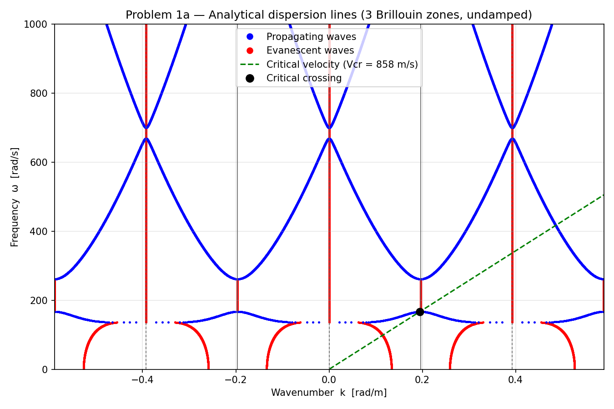

The lowest propagating branch, the acoustic branch, is narrow and sits between roughly 144 and
167 rad/s. The green dashed line is the critical-velocity construction discussed in part (c); it is
tangent to that branch at about 857 m/s, touching at $k \approx 0.195$ rad/m and
$\omega \approx 167$ rad/s.

---

## (b) Numerical dispersion (ANSYS modal analysis)

### Finite element model

We built a 160 m beam in ANSYS Mechanical APDL using 160 `BEAM3` elements of length 1 m (161 nodes),
with 11 `COMBIN14` spring elements placed every 16 m, connecting beam nodes 1, 17, ..., 161 to fixed
ground nodes, and simply-supported ends. For the dispersion comparison the supports are undamped
($c_s = 0$), so the model is consistent with part (a). A Block-Lanczos modal analysis returned 73
modes between 13.55 Hz and 398 Hz.

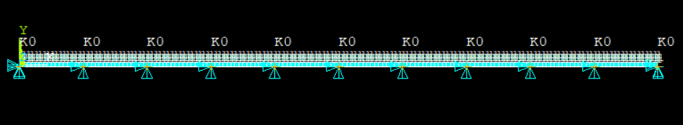

### Wavenumber from mode order

For a simply-supported beam, mode $n$ has $n$ half-waves over the length, so the wavelength is
$\lambda_n = 2L/n$ and

$$\omega_n = 2\pi f_n, \qquad k_n = \frac{2\pi}{\lambda_n} = \frac{n\pi}{L}.$$

The first Brillouin-zone edge $k = \pi/d$ is reached at $n = L/d = 10$, so the first ten modes fill
the first acoustic band.

### Mode shapes and the first-mode artefact

Looking at the mode shapes, the first mode (13.55 Hz) does not show a sensible beam pattern: its
vertical displacement is essentially zero, so it is a numerical artefact of the finite,
simply-supported domain rather than a genuine Bloch wave. A Bloch wave cannot exist below the bottom
of the acoustic band (its wavenumber would be imaginary), and 13.55 Hz lies below that band, which
confirms the same thing. We therefore exclude mode 1 and use modes 2 onward.

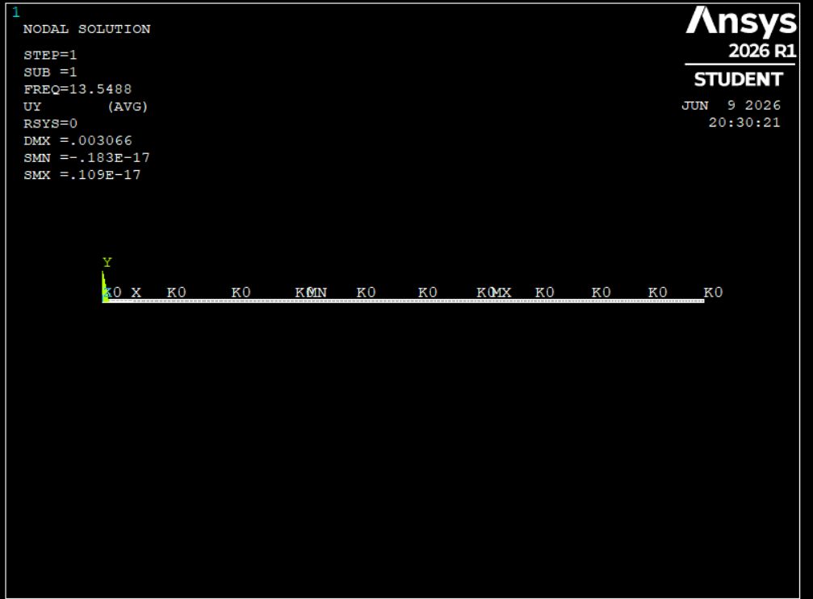

The first two genuine modes (ANSYS modes 2 and 3, both near 21.6 Hz) do show clear, well-formed wave
shapes along the beam, which is what we expect from the acoustic branch:

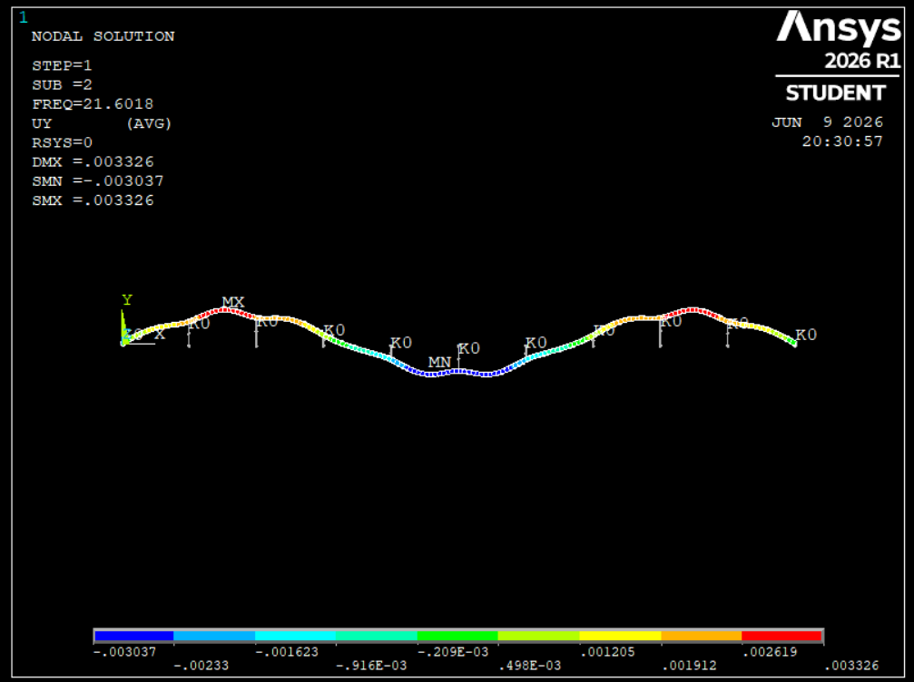

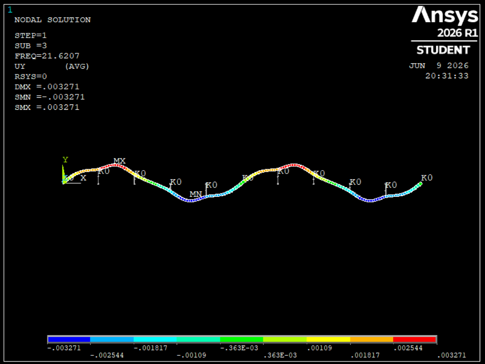

### Sanity check: low support stiffness

To make sure the model itself is sound, we re-ran the modal analysis with the support stiffness
reduced to near zero. With the springs effectively removed, the structure should behave like an
ordinary simply-supported beam, and that is exactly what we see: the first mode is a clean half-sine
and the second is a full sine. This confirms that the model is built correctly and that the higher
modes of the stiff model can be trusted.

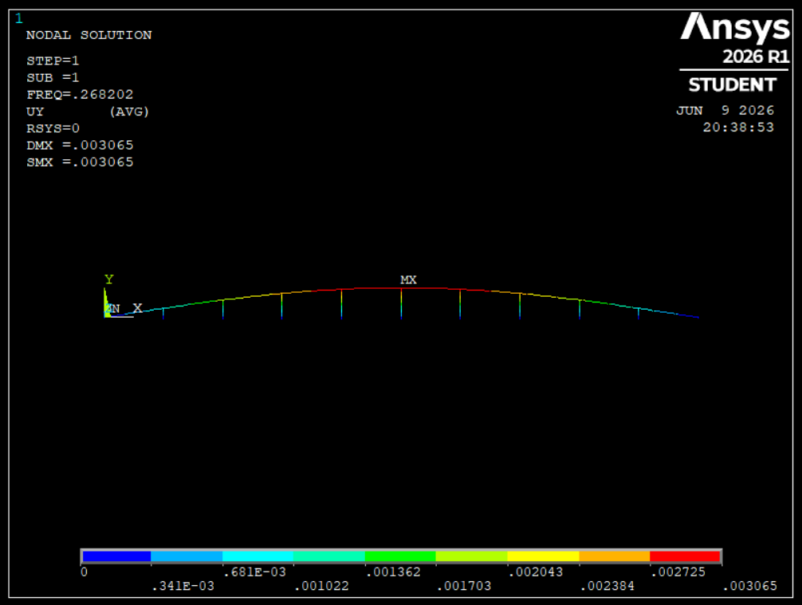

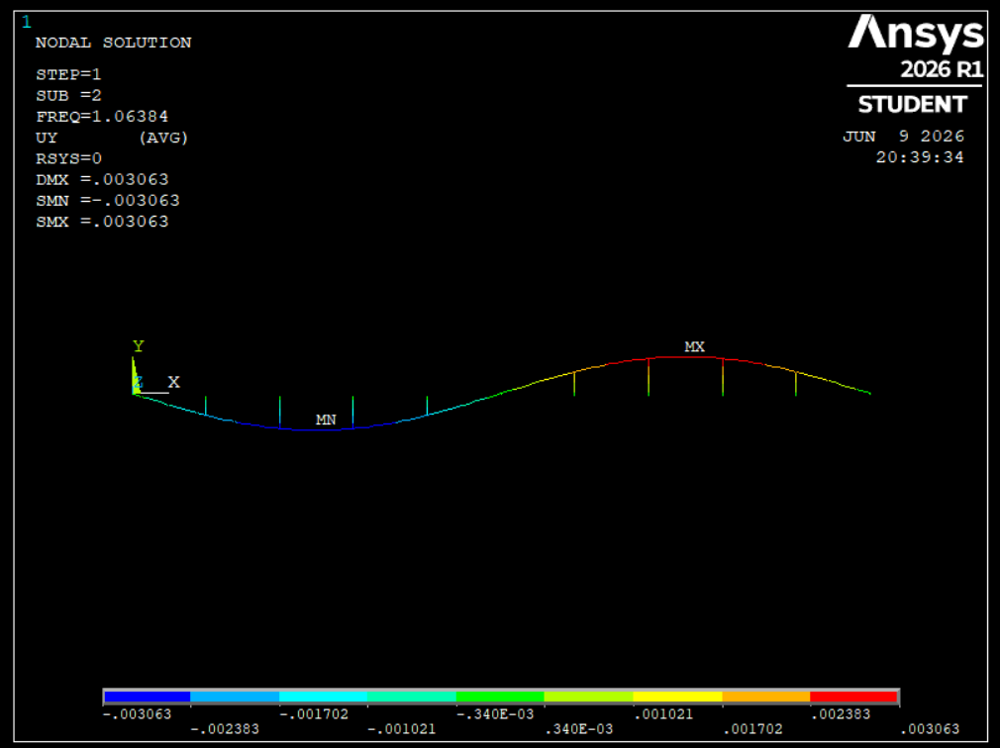

### Dispersion comparison

Plotting $(k_n, \omega_n)$ for the FE modes gives the numerical dispersion curve, which we then
overlay on the analytical result:

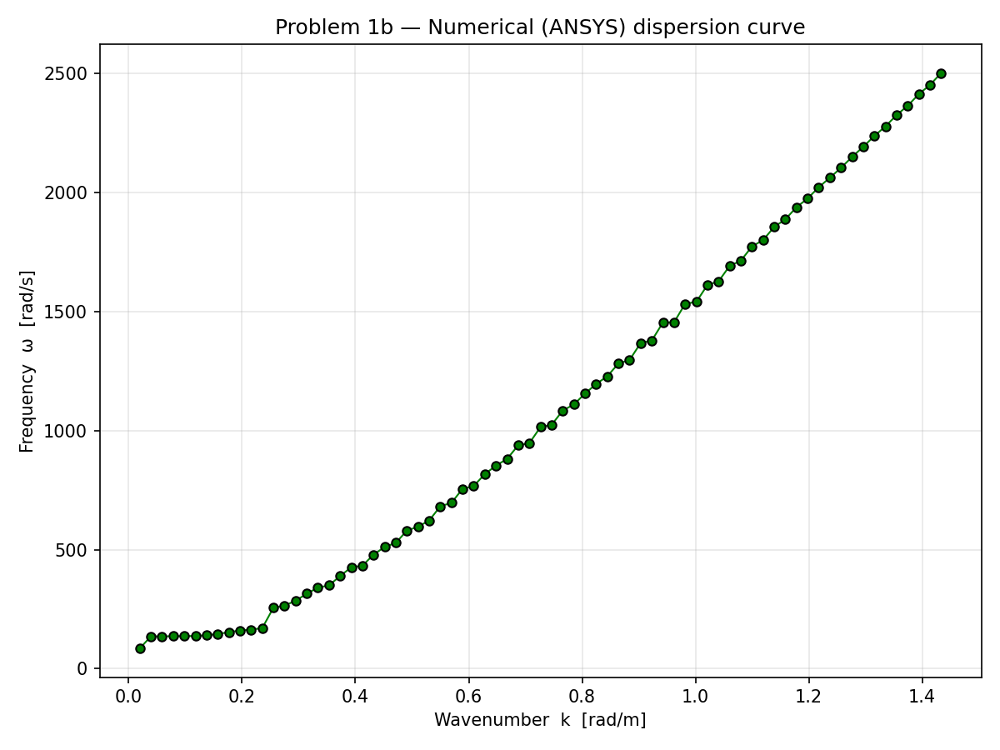

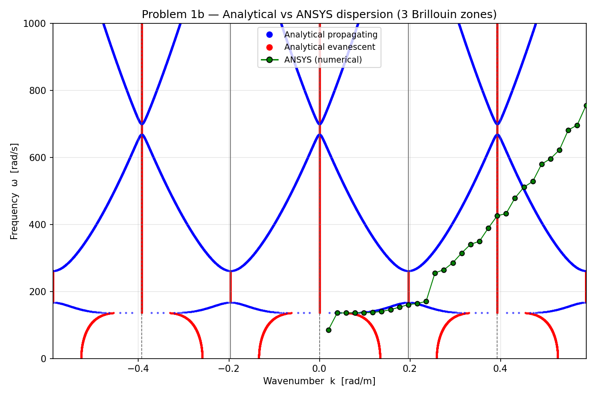

The two curves agree very well in the first Brillouin zone at low frequency, which is the region
that controls the critical velocity. Two differences appear higher up. At the first stop band the
analytical curve has a vertical tangent (zero group velocity), while the discrete FE modes cannot
capture that singularity and stay sloped. At high frequency the wavelength shrinks toward the 1 m
element size, so the mesh can no longer resolve the waves and the numerical curve drifts below the
analytical one. Both effects are expected limitations of a finite, discretised model.

The numerical critical velocity (the lowest phase velocity in the first zone) comes out at 818 m/s
against the analytical 857 m/s, about 4.7 percent apart. We consider that good agreement given that
the two models are so different, one infinite and continuous, the other finite and discrete.

---

## (c) Critical velocity and time-domain verification

### Determining the critical velocity

The critical velocity is the smallest speed at which the kinematic invariant line $\omega = kV$
becomes tangent to the lowest propagating branch. Geometrically this is
$V_\text{cr} = \min_k(\omega/k)$, the slowest energy-carrying wave on that branch. Below it, the load
cannot match any propagating wave and produces only a local, evanescent dip. At it, the load travels
with a wave and keeps feeding energy into it, which gives resonance. Above it, the line crosses the
branches at two points and the load radiates two trailing waves.

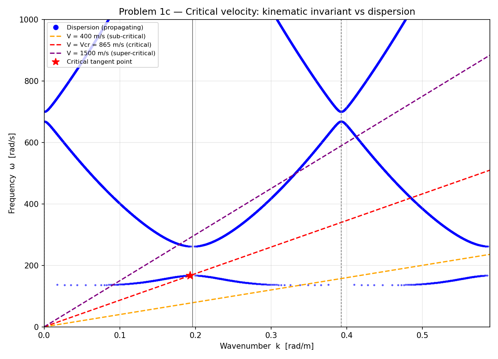

### Verification by time-domain simulation

We ran the moving-load transient in ANSYS at three speeds: 400 m/s (sub-critical), 835 m/s (close to
critical) and 1500 m/s (super-critical). The load $F_0$ is applied as consistent nodal forces and
moments through cubic shape functions so that it moves smoothly between nodes, and the support
damping $c_s$ is switched on for the physical response. We recorded the vertical deflection at three
mid-bay nodes. The ANSYS time histories are shown below, followed by the combined plot.

| Sub-critical (400 m/s) | Critical (835 m/s) | Super-critical (1500 m/s) |
|---|---|---|
| 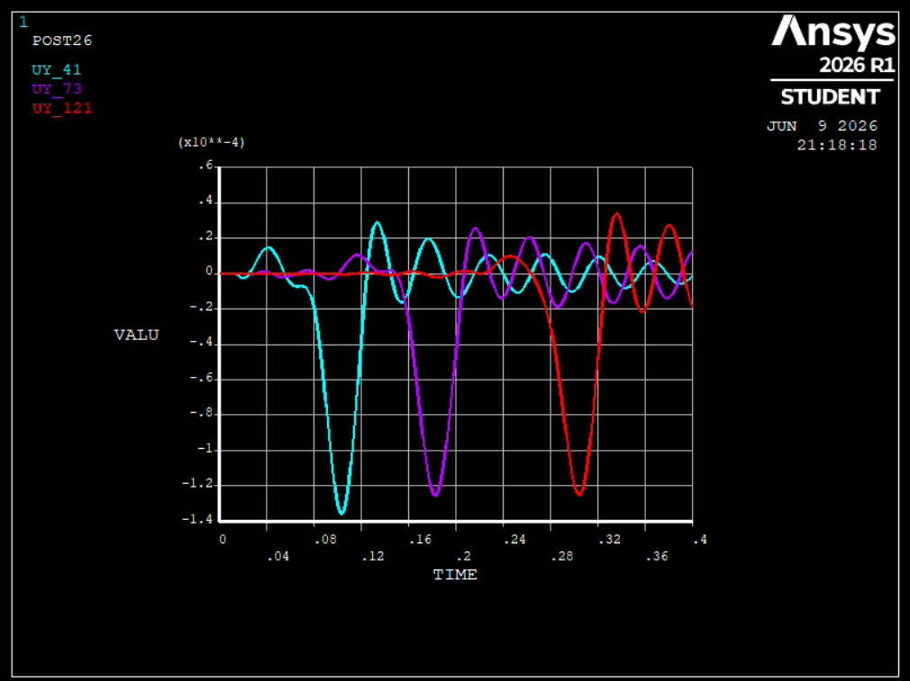 | 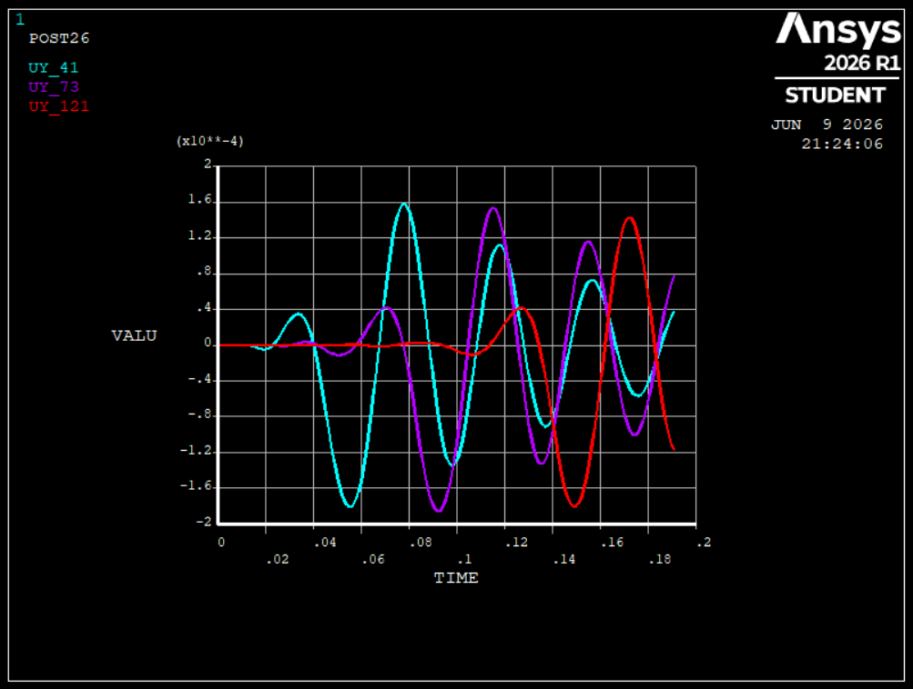 | 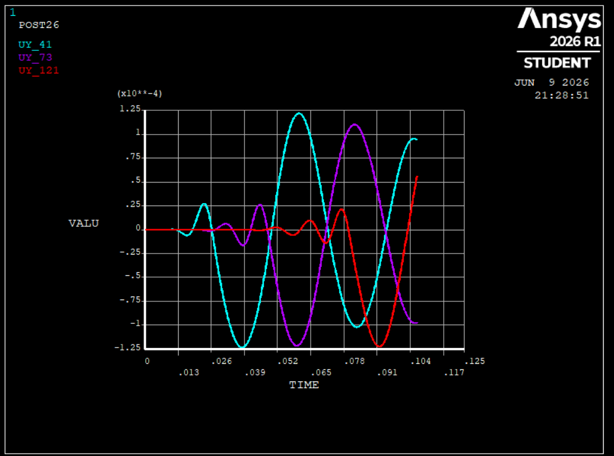 |

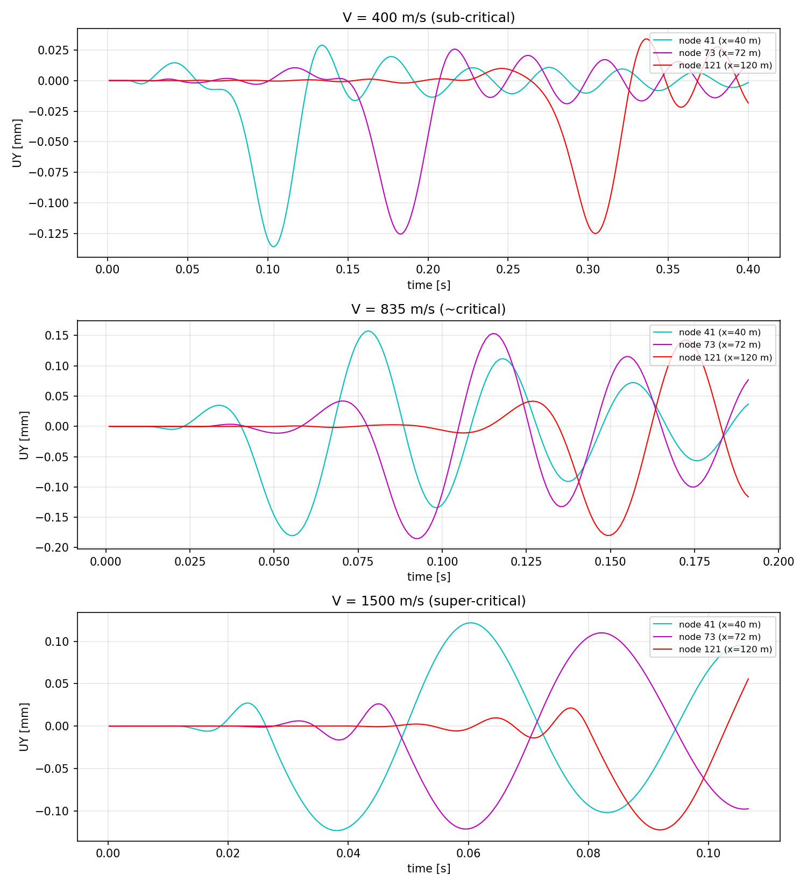

Reading the results:

* **Sub-critical.** Each node shows a single downward dip exactly when the load passes over it (node
  41 at $t = 40/400 = 0.10$ s, node 73 at 0.18 s, node 121 at 0.30 s). The deformation rides along
  with the load and there is no sustained wave train, which is the localised, non-radiating response
  the dispersion curve predicts below $V_\text{cr}$.
* **Critical.** The oscillation builds up in amplitude as the load travels, because energy keeps
  accumulating, and the ring frequency is about 145 to 160 rad/s. This matches the dispersion
  tangent at $\omega \approx 167$ rad/s to within about 10 percent, a useful cross-check between the
  time-domain and frequency-domain results.
* **Super-critical.** Instead of one clean dip we see sustained trailing oscillations, because the
  load now outruns waves and radiates them.

### Sanity check: peak deflection against speed

The peak mid-bay deflections are 0.136 mm at 400 m/s, 0.185 mm at 835 m/s, and 0.123 mm at
1500 m/s. The maximum occurs close to $V_\text{cr}$ and falls off on both sides. That hump is the
resonance, and it is the clearest verification that the critical velocity is real and sits near
835 m/s. The amplification is modest (about 1.4 times) rather than dramatic, because of the support
damping and the short time the load spends on a finite 160 m beam, but the trend is unambiguous.

Three independent routes, the analytical dispersion (857 m/s), the numerical dispersion (818 m/s)
and the time-domain peak (about 835 m/s), all land within a few percent of each other.

---

## (d) Effect of support stiffness $k_s$

The intuitive answer is that stiffer supports raise the critical velocity, and for soft supports
that is true. A higher $k_s$ lifts the cut-on frequency of the lowest band, which scales as
$\omega_c \sim \sqrt{k_s/(\rho d)}$, so the kinematic invariant becomes tangent at a higher phase
velocity and roughly $V_\text{cr} \propto \sqrt{k_s}$.

At this design point, however, the supports are already effectively rigid, and that changes the
answer. The lowest band is bounded at the zone edge by the pinned-span bending mode

$$\omega_\text{span} = \left(\frac{\pi}{d}\right)^2 \sqrt{\frac{EI}{\rho}} = 167\ \text{rad/s}.$$

This mode has displacement nodes exactly at the supports, so the spring carries no force there. That
means $\omega_\text{span}$, and with it the ceiling $V_\text{cr} = \omega_\text{span}/(\pi/d)
\approx 851$ m/s, does not depend on $k_s$ at all. Our parametric study confirms it: $V_\text{cr}$
stays flat at about 851 m/s as $k_s$ is increased from one to three times the baseline.

So the honest answer is that increasing $k_s$ raises $V_\text{cr}$ only while the supports are soft
enough to matter. Once they are effectively rigid, which is the case here, we hit a ceiling set by
the 16 m span. To genuinely raise the critical velocity at this design, the effective levers are
reducing the support spacing $d$ (the ceiling scales like $1/d$) or increasing the bending stiffness
$EI$, not stiffening the springs further.

---

## Conclusion

We modelled the hyperloop as a periodically supported Euler-Bernoulli beam, both analytically and in
ANSYS. The analytical dispersion relation followed from Floquet's theorem and a fourth-order
polynomial in $\xi = e^{-ikd}$, giving a clear band structure of propagating and evanescent waves
over three Brillouin zones. The ANSYS modal analysis reproduced this dispersion from the natural
frequencies through $k_n = n\pi/L$. The two agree well in the first Brillouin zone at low frequency
and diverge at high frequency, as expected from the finite mesh and finite length.

The critical velocity came out at 857 m/s from the analytical model, 818 m/s from the numerical
model, and about 835 m/s from the time-domain peak deflection, an agreement within a few percent
across three independent methods. The moving-load simulations behaved as the dispersion analysis
predicts: a localised dip below $V_\text{cr}$, resonant amplification at $V_\text{cr}$, and trailing
waves above it.

Finally, the parametric study showed that, contrary to the simple "stiffer is faster" intuition,
$V_\text{cr}$ is essentially saturated at this design because the supports are already near-rigid and
the limit is set by the 16 m span bending mode. Reducing the span or increasing $EI$ would be the
real way to push the critical velocity higher.

Two sanity checks supported the work along the way. The low-stiffness re-run confirmed that the FE
model recovers the plain-beam mode shapes and flagged mode 1 as a boundary artefact, and the
peak-deflection-against-velocity hump confirmed the critical velocity from an independent,
time-domain angle.

### Limitations

The analytical model is infinite while the FE model is finite (160 m), which produces
boundary-localised modes such as the artefact at mode 1. The 1 m mesh limits the shortest wavelength
the model can resolve. Everything assumes linear elasticity, so large-amplitude and non-linear
effects near resonance are not captured.
