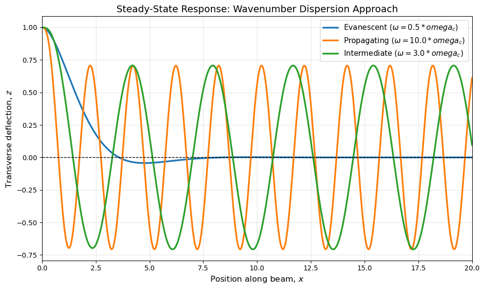
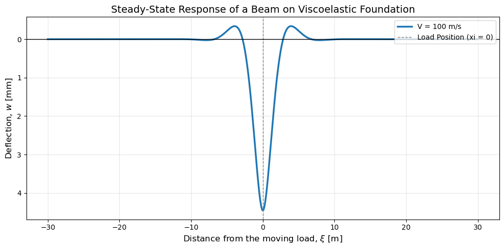
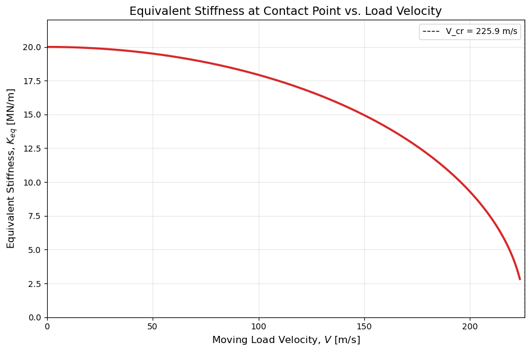
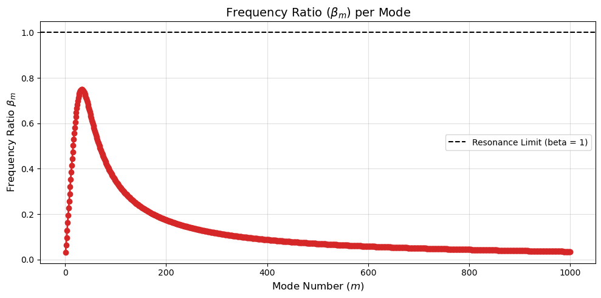
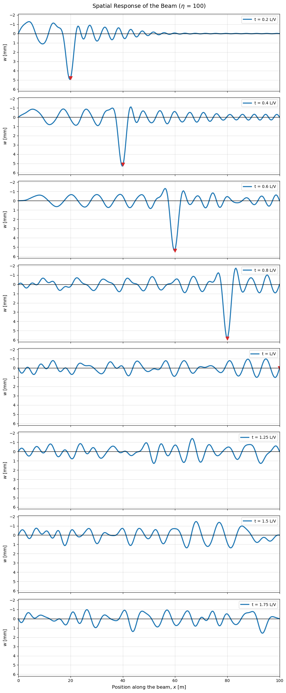
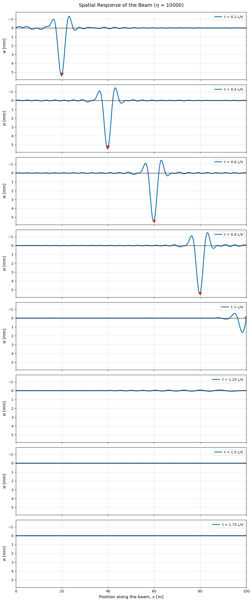
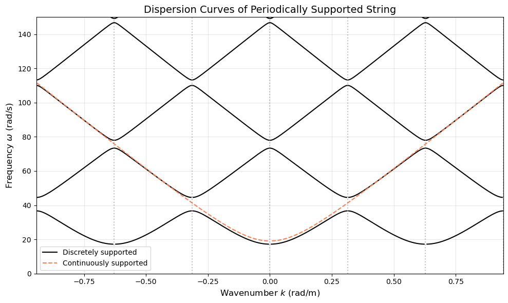
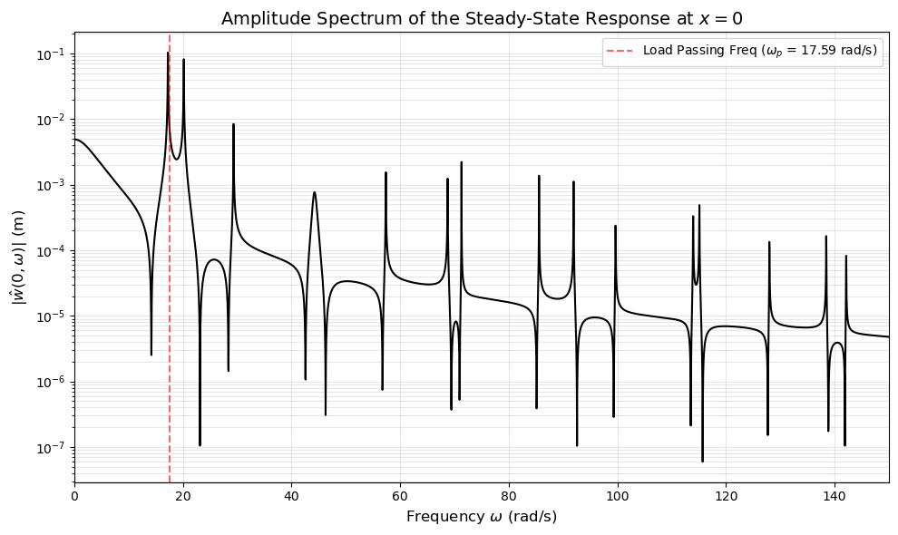
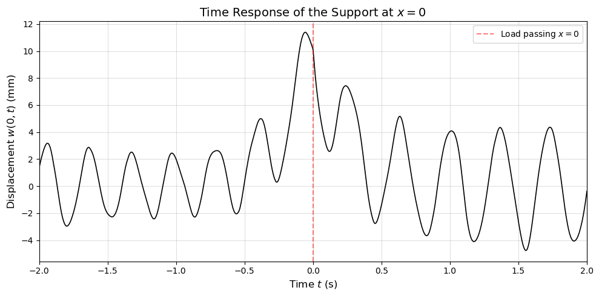

# Dynamics of Structures under Moving Loads, Part A 

| Student | Student ID |
|---|---|
| Jose Orlando Meija Sanchez | 6457037 |
| Anna Werner| 6611257 |
| JeongWoo Cho | 5127548 |
| Gabriel Dalhuizen Izquierdo| 5829615 | 
| Mohammed Wasay | 6416071 |

## Introduction

The derivation for the symbolic solutions of the questions of part A are given in full detail with explanation in this report. Consequently, the plotting of the derived solutions are given in the notebook file, `movingloads.ipynb`. The intepretation of the plotted results are also discussed in this report at the end of each subquestion. 

The parameters used for plotting are in line with the values provided in the assignment specification: 

Question 2 ~ 4
| Symbol | Value | Quantity |
|---|---|---|
| $EI$ | $6.42\times10^{6}$ Nm² | bending stiffness |
| $\rho A$ | 268.3 kg/m | mass per unit length |
| $\chi$ | $7.3\times10^{6}$ N/m² | distributed spring stiffness |
| $\eta$ | $1\times10^2$ Ns/m² | distributed dashpot |
| $Q_0$ | $80\times10^3$ N | external load |

Question 5 
| Symbol | Value | Quantity |
|---|---|---|
| $\rho A$ | 1.1 kg/m | mass per unit length |
| $T$ | $15\times10^3$ Nm²| (constant) tension force |
| $L$ | $10$ m| Length |
| $k_s$ | $4\times10^{3}$ N/m | spring stiffness of discrete supports |
| $\eta_s$ | $0.5$ Ns/m | dashpot constant of discrete supports |
| $Q_0$ | $55$ N | external load |
| $V$ | $28$ m/s  | velocity of load |

### 1. Derive and plot (for a fixed moment in time) the steady-state response of a semi-infinite beam subject to an oscillatory load at the boundary with a relatively small excitation frequency as well as with a relatively large excitation frequency (as compared to the cut-off frequency). Interpret the result.

We solve for an Euler-Bernoulli beam on an elastic foundation, subject to a harmonic boundary load. The equation of motion can be defined as: 

$$\rho A\frac{\partial^{2}w}{{\partial t}^{2}}+EI\frac{\partial^{4}w}{\partial x^{4}}+\chi w=0$$

Assuming a harmonic wave solution of the form $w(x,t)=C \exp(i(\omega t-kx))$, substituting this into the equation of motion yields the dispersion equation:

$$k^{4}-\frac{\rho A}{EI}\omega^{2}+\frac{\chi}{EI}=0$$

This dispersion relation governs which types of waves can exist in the beam at a given excitation frequency $\omega$. The critical boundary between wave types is defined by the cut-off frequency, $\omega_{c}$, where $\omega_{c}^{2}=\frac{\chi}{\rho A}$

We solve for k, which has 4 complex roots. We are only interested in waves that radiate or decay to the right. We filter the roots to get the 2 that we are interested in: 

- Evanescent waves: Roots with a negative imaginary part ($\text{Im}(k) < 0$). These result in $e^{-|\text{Im}(k)|x}$, meaning the amplitude decays exponentially as $x \to \infty$.  
- Propagating waves: Roots that are purely real and positive ($\text{Im}(k) = 0, \text{Re}(k) > 0$). These correspond to harmonic waves traveling in the positive $x$-direction.

With the two valid wavenumbers ($k_1, k_2$), the total spatial response is assumed to be $C_1e^{-ik_1x} + C_2e^{-ik_2x}$. At the boundary, kinematic boundary conditions are imposed (unit displacement w(0, t) = 1 and w'(0, t) = 0) to solve or the complex amplitudes. 

The steady-state response is obtained by taking the real part of the complex spatial response multiplied by harmonic time term $e^{i\omega t}$ which is plotted. 

$\textbf{Interpretation of Results}$

The three frequency scenarios evaluated in the code showcase the fundamental behavioral shift defined by the cut-off frequency $\omega_c$:

- Quasi-static / Sub-critical Response ($\omega = 0.5\omega_c$):
When the excitation frequency is below the cut-off frequency ($0 < \omega < \omega_c$), the roots of the dispersion equation are complex. Physically, the inertia of the beam ($\rho A \omega^2$) is insufficient to overcome the stiffness of the elastic foundation ($\chi$). Therefore, no propagating waves are excited. The energy remains localized near the load at the boundary, resulting in a strictly evanescent spatial profile that decays rapidly to zero without sustained spatial oscillation.  

- Intermediate Super-critical Response ($\omega = 3.0\omega_c$):
When the excitation frequency exceeds the cut-off frequency ($\omega > \omega_c$), real roots emerge from the dispersion equation. The beam's inertia now dominates the foundation stiffness, allowing the structure to radiate energy away from the boundary. This manifests as sustained, sinusoidal propagating waves traveling along the positive $x$-axis.  

- High Super-critical Response ($\omega = 10.0\omega_c$):
As the excitation frequency increases further above $\omega_c$, the corresponding real wavenumber $k$ increases ($k \approx \sqrt{\omega} \sqrt[4]{\rho A/EI}$). Because the wavenumber $k$ is inversely proportional to the wavelength ($k = 2\pi/\lambda$), a higher frequency results in a significantly shorter wavelength.  

### 2. Consider an infinite beam with continuous visco-elastic foundation, subject to a constant moving load. The equation of motion reads as follows $$\rho A \frac{\partial^2 w}{\partial t^2} + EI \frac{\partial^4 w}{\partial x^4} + \chi w + \eta \frac{\partial w}{\partial t} = Q_0 \delta(x - Vt)$$ Derive and compute the steady-state response in the moving reference system for a sub-critical velocity (note that the critical velocity is approximately the same as that of the undamped system) and plot the result. 

We introduce the moving reference system $\xi = x - Vt$, which makes the deflection profile constant over time in this reference system $w(x,t) \to w(\xi)$.

Applying chain rule to convert the partial derivatives x and t to $\xi$ yields and ODE in the moving coordinate. 

$$\rho A V^2 \frac{d^2 w}{d\xi^2} + EI \frac{d^4 w}{d\xi^4} + \chi w - \eta V \frac{dw}{d\xi} = Q_0 \delta(\xi)$$

We transform the equation from the spatial domain to the wavenumber domain k using spatial Fourier transform, defined as: 

$$\tilde{w}(k) = \int_{-\infty}^{\infty} w(\xi) e^{-ik\xi} d\xi \quad \text{and} \quad w(\xi) = \frac{1}{2\pi} \int_{-\infty}^{\infty} \hat{w}(k) e^{ik\xi} dk$$

We plug in the inverse Fourier transform into the equation of motion.
$$\rho A V^2 \left[ \frac{1}{2\pi} \int \tilde{w}(k) (-k^2) e^{ik\xi} dk \right] + EI \left[ \frac{1}{2\pi} \int \tilde{w}(k) (k^4) e^{ik\xi} dk \right] + \chi \left[ \frac{1}{2\pi} \int \tilde{w}(k) e^{ik\xi} dk \right] - \eta V \left[ \frac{1}{2\pi} \int \tilde{w}(k) (ik) e^{ik\xi} dk \right] =  \frac{1}{2\pi} \int_{-\infty}^{\infty} (Q_0) e^{ik\xi} dk$$

 $$\left[ -\rho A V^2 k^2 + EI k^4 + \chi - i\eta V k \right] \tilde{w}(k) = Q_0$$

Isolating $\tilde{w}(k)$, we obtain the steady-state response in the frequency/wavenumber domain:$$\tilde{w}(k) = \frac{Q_0}{EI k^4 - \rho A V^2 k^2 + \chi - i\eta V k}$$

The physical deflection profile $w(\xi)$ is found by applying the inverse Fourier transform:$$w(\xi) = \frac{1}{2\pi} \int_{-\infty}^{\infty} \frac{Q_0}{EI k^4 - \rho A V^2 k^2 + \chi - i\eta V k} e^{ik\xi} dk$$

Assuming that the critical velocity is approximately the same as that of the undamped system, it occurs when the moving load travels at the same speed as the lowest phase velocity of bending waves in the foundation. This is when the real part of the denominator = 0. 
$$EI k^4 - \rho A V^2 k^2 + \chi = 0 \implies V^2 = \frac{EI k^4 + \chi}{\rho A k^2} = \frac{EI}{\rho A}k^2 + \frac{\chi}{\rho A k^2}$$

To find the minimum velocity that satisfies this, we take the derivative with respect to $k^2$ and set it to zero, which yields $k^2 = \sqrt{\chi / EI}$. Substituting this back into the velocity equation gives the critical velocity:$$V_{cr} = \sqrt{\frac{2\sqrt{EI \chi}}{\rho A}}$$Using the provided parameters, $V_{cr} \approx 225.9$ m/s. For our sub-critical calculation, we will choose $V = 100$ m/s.

$\textbf{Interpretation of Results}$

Again, since the velocity is lower than the critical velocity; no energy is radiated away from the load as propagating waves. The deflection decays rapidly with increasing $\xi$, which looking in space and time will simply translate the localised deflection profile at the speed of the load ($\xi = x - Vt$). The result is a localized, symmetric deflection bowl that translates at the speed of the load without radiating any propagating waves.

A small damping (compared to stiffness) is introduced to prevent a division by zero when $V = V_{cr}$ causing numerical integration to blow up. This damping is negligible compared to the foundation stiffness, therefore, we see almost the same response that we would expect for a purely elastic foundation response; giving a symmetric response at the point of loading. This would have not been the case if the damping coefficient was comparable to that of the stiffness coefficient. 

### 3. For the same problem considered in the previous question, derive and compute the equivalent stiffness at the loading/contact point and plot it versus velocity. Consider in the plot only the sub-critical velocity range (up to the 99% of the critical velocity) and explain what you observe.

The equivalent stiffness $K_{eq}$ at the loading point is defined as the ratio of the applied external load $Q_0$ to the actual deflection $w(0)$ occurring directly underneath that load (at $\xi = 0$).$$K_{eq} = \frac{Q_0}{w(0)}$$

To find the deflection exactly at the contact point, we set $\xi = 0$. The exponential term $e^0$ becomes exactly 1:$$w(0) = \frac{Q_0}{2\pi} \int_{-\infty}^{\infty} \frac{1}{(EI k^4 - \rho A V^2 k^2 + \chi) - i(\eta V k)} dk$$

For which the $K_{eq}$ can be defined as $$K_{eq} = \frac{2\pi}{\int_{-\infty}^{\infty} \frac{1}{(EI k^4 - \rho A V^2 k^2 + \chi) - i\eta V k} dk}$$

$\textbf{Interpretation of Results}$

The plot of equivalent stiffness against load velocity visualises the structure's ability to resist deformation degrades as the load moves faster. 
- Static regime (V ~ 0): Curve is flat, at low speeds, the inertial term $\rho A V^2 k^2$ not significant. The equivalent stiffness is governed by the bending stiffness of the beam (EI) and the foundation stiffness ($\chi$). The structure behaves almost as the load was stationary. 
- Inertial softening: According to the denominator term, $EI k^4 + \chi - \rho A V^2 k^2$, as velocity increases, the equivalent stiffness starts to drop. As the load travels faster, the beam's inertia helps the load to push it down further, leading to a larger deformation for the same applied mass.
- Dynamic resonance ($V = V_{cr}$): As the velocity approaches the critical speed, the equivalent stiffness approaches zero. Theoretically, at $V = V_{cr}$ the upward elastic stiffnesses is perfectly canceled out by the downward inertial forces. Because the real part of the denominator reaches zero, the deflection at the point of the load reaches infinity; which is a state of dynamic resonance. The curve doesn't exactly reach 0 explicitly due to the added minimal viscous damping to prevent division by zero. Theoretically, without any added viscous damping, the equivalent stiffness will indeed equal 0 at $V = V_{cr}$. 

### 4. Consider a beam with continuous visco-elastic foundation having finite length and being simply supported at the edges, and excited by a constant moving load. Derive and compute the response of the structure and plot the response for a number of time moments (include one with t > L/V). Explain the observed behaviour (in terms of steady state and transient effects). Use the same parameter values as in Problem 2, take the velocity of the load 0.75 times the critical speed of the infinite beam with distributed elastic foundation and assume the length sufficiently long so that the steady-state profile of the infinite beam under the same load can develop (e.g., 100 m); include as many modes as needed for convergence (if needed, increase the value of η to make sure that the number of modes is not too large; damping decreases the importance of higher modes). 

The equation of motion of an Euler Bernoulli beam on a continuous visco-elastic foundation with finite length, simply supported at the edges, and excited by a constant moving load can be described as following: 
 $$EI \frac{\partial^4 w(x,t)}{\partial x^4} + \chi w(x,t) + {\eta \frac{\partial w(x,t)}{\partial t}} + \rho A \frac{\partial^2 w(x,t)}{\partial t^2} = F(x,t) = Q_0 \delta(x - Vt) [H(t) - H(t - L/V)]$$

 Where $\chi$ is the elastic foundation coefficient, $\eta$ the viscous foundation coefficient, and a double heaviside function is used in the excitation to capture the "turn-off" effect after the load leaves the finite beam. 

 We use modal expansion, assuming that deflection can be separated into a sum of spatial sinusodial mode shapes and time-dependent modal coordinates. 
 $$w(x,t) = \sum_{n=1}^{\infty} \sin\left(\frac{n\pi x}{L}\right) q_n(t)$$

 Substituting the assumed solution in the PDE gives: 
 $$\sum_{n=1}^{\infty} \left[ EI \left(\frac{n\pi}{L}\right)^4 + \chi \right] \sin\left(\frac{n\pi x}{L}\right) q_n(t) + \sum_{n=1}^{\infty} \eta \sin\left(\frac{n\pi x}{L}\right) \dot{q}_n(t) + \sum_{n=1}^{\infty} \rho A \sin\left(\frac{n\pi x}{L}\right) \ddot{q}_n(t) = Q_0 \delta(x - Vt) [H(t) - H(t - L/V)]$$

Looking at the free vibration case, we can derive the following relation (also given in the assignment description): 
$$EI \left(\frac{n\pi}{L}\right)^4 = \rho A \omega_n^2 - \chi$$

Substituting this in the first bracket cancels out $\chi$. Foundation stiffness is now completely expressed in the $\omega_{n}$ term. 

$$\sum_{n=1}^{\infty} \left[ \rho A \ddot{q}_n + \eta \dot{q}_n + \rho A \omega_n^2 q_n \right] \sin\left(\frac{n\pi x}{L}\right) = Q_0 \delta(x - Vt) \left[ H(t) - H(t - L/V) \right]$$

 We eliminate the summation by using the orthogonality property, multiplying the PDE by  $\sin(\frac{m\pi x}{L})$ and integrating over the length of the beam. 

 $$\frac{L}{2} \left( \rho A \ddot{q}_m + \eta \dot{q}_m + \rho A \omega_m^2 q_m \right) = \int_0^L Q_0 \delta(x - Vt) \sin\left(\frac{m\pi x}{L}\right) [H(t) - H(t - L/V)] dx$$

 The right hand side integrates a dirac delta function at x = Vt, hence we used the sifting property to evalute the right hand side to be : 
 $$\text{Right Hand Side} = Q_0 \sin\left(\frac{m\pi V t}{L}\right) [H(t) - H(t - L/V)]$$
 
 Dividing the whole equation by the modal mass $\left(M_n = \rho A \frac{L}{2}\right)$, the equation of motion is simplified into: 
 $$\ddot{q}_m(t) + 2\zeta_m \omega_m \dot{q}_m(t) + \omega_m^2 q_m(t) = \frac{2Q_0}{\rho A L} \sin(\Omega_m t) [H(t) - H(t - L/V)]$$

 For which we have defined: 

 - Natural frequency squared: $\omega_m^2 = \frac{EI (m\pi/L)^4 + \chi}{\rho A}$
 - Modal forcing frequency: $\Omega_m = \frac{m\pi V}{L}$
 - Modal damping ratio: $\zeta_m = \frac{\eta}{2\rho A \omega_m}$

The form of the equation of motion is derived such that the Green's function can be applied, as suggested by the assignment description. Which is defined as the following: 

$$\ddot{g}_n + 2\zeta_n \omega_n \dot{g}_n + \omega_n^2 g_n = \delta(t)$$
$$g_n(t) = \frac{1}{\omega_{dn}} e^{-\zeta_n \omega_n t} \sin(\omega_{dn} t) H(t), \omega_{dn} = \omega_n \sqrt{1 - \zeta^2}$$

The Green's function gives the response of the beam of a single infinesimally short excitation at t=0. To get the total response for a moving load $q_n(t)$ we use the Duhamel's integral to get the excitation at current time t as a sum of the past tiny impulses (Green's function). 

$$q_m(t) = \int_0^t f_m(\tau) g_m(t - \tau) d\tau$$

Substituting the forcing term and the Green's function gives the total reaction as : $$q_m(t) = \frac{2Q_0}{\rho A L \omega_{dm}} \int_0^t \sin(\Omega_m \tau) e^{-\zeta_m \omega_m (t-\tau)} \sin(\omega_{dm} (t-\tau)) d\tau, for (t < L/V)$$
and 
$$q_m(t) = \frac{2Q_0}{\rho A L \omega_{dm}} \int_0^{L/V} \sin(\Omega_m \tau) e^{-\zeta_m \omega_m (t-\tau)} \sin(\omega_{dm} (t-\tau)) d\tau, for (t > L/V)$$

$\textbf{Interpretation of Results}$

The frequency ratio $\beta_m = \Omega_m / \omega_m$ provides the theoretical basis for mode dominance.
 Unlike the slides (which assume a free beam) this case has foundation stiffness constant ($\chi$) which makes the natural frequency $\omega_m$ relatively flat for low modes. Consequently, $\beta_m$ increases initially with $m$ before eventually decaying.
 One might argue that based on the frequency ratio graph, ~800 modes would be required for convergence, but we limit to 50 modes to prevent numerical aliasing. 

Forced regime (t < L/V):
- Steady state component: like the infinite beam case, because the load velocity is sub-critical ($V = 0.75 V_{cr}$), the system’s inertial forces are insufficient to overcome the bending stiffness and foundation stiffness. Consequently, the forced response is purely evanescent. It manifests as a localized deflection bowl that translates at velocity $V$. Unlike super-critical systems, no propagating waves are radiated continuously by the load.
- Transient Impact: At $t = 0$, the entry of the load acts as a Dirac-delta-like impulse. To represent the sharp "V-shape" curvature required by a point load using global sine-wave modes, the system must excite a broad spectrum of higher-order modes. This generates high-frequency bending waves that propagate across the beam at their intrinsic phase velocities, reflecting off the pinned boundaries.

Free vibration regime (t > L/V):

Once the load leaves the beam, the external forcing term $Q(x,t)$ drops to zero. The beam enters a state of free vibration.
The irregular response observed is the result of the superposition multiple natural modes ($m=1, 2, ..., n$) vibrating simultaneously at their distinct natural frequencies ($\omega_n$).Because each mode oscillates at a different frequency, they rapidly drift out of phase. The "irregular" appearance is not numerical noise, but the physical interference pattern of these distinct frequencies. As the damping $\eta$ dissipates energy, these modes decay at a rate proportional to $\frac{\eta}{2\rho A}$, causing the beam to settle toward its equilibrium position.

Increasing the damping coefficient $\eta$ acts as a surrogate for "radiation damping." In the infinite beam case, the transient waves travel to infinity and never return. In the finite beam, reflections from the boundaries cause interference. By increasing $\eta$, we ensure that these reflected waves are dissipated before they can dominate the forced steady-state response. This explains why higher damping makes the finite beam response visually indistinguishable from the infinite beam response—it effectively "hides" the boundaries.

### 5. Consider an overhead powerline structure of a railway track, which is modelled as an infinite tensioned string that is periodically supported by discrete springs and dashpots. 

#### a) Prove that the dispersion equation of the system (without damping) reads as follows:

$$\xi^2 - \left( \frac{K_s}{\kappa} \sin(\kappa L) + 2\cos(\kappa L) \right)\xi + 1 = 0$$

We look for the free harmonic waves of the system to find the dispersion equation (no external load and damping). Consequently, the governing equation of motion simplifies to: 

$$\rho A \frac{\partial^2 w}{\partial t^2} - T \frac{\partial^2 w}{\partial x^2} + \sum_{n=-\infty}^{\infty} k_s w \delta(x - nL) = 0$$

Again, we assume a steady-state harmonic wave solution in the form $w(x,t) = W(x)e^{i\omega t}$, upon substitution we get the following ODE: 

$$-\rho A \omega^2 W(x) - T \frac{d^2 W(x)}{dx^2} + \sum_{n=-\infty}^{\infty} k_s W(x) \delta(x - nL) = 0$$

Dividing by T; we can define wavenumber $\kappa$ for the string without supports: 
$$\kappa^2 = \frac{\rho A \omega^2}{T} \implies \kappa = \frac{\omega}{\sqrt{T/\rho A}} = \frac{\omega}{c}$$

We divide the string into periodic cells. The dirac functions vanish for the inner part of an arbitrary cell m (between x = mL and x = (m+1)L) (not for the interface conditions).
Defining a local coordinate $x_m = x - mL$ such that $0 \leq x_m \leq L$, we get $$\frac{d^2 W_m}{dx_m^2} + \kappa^2 W_m = 0$$ for which the general steady-state solution is $$W_m(x_m) = A_m \cos(\kappa x_m) + B_m \sin(\kappa x_m)$$

Between adjacent cells m and m+1, 2 interface conditions are imposed (ODE 2nd order): 
$$W_m(L) = W_{m+1}(0)$$ and $$W'_{m+1}(0) - W'_m(L) = K_s W_{m+1}(0),  K_s = \frac{k_s}{T} $$

Additionally, we use the Floquet's theorem which states that for a period structure, the wave solution translates from one cell to the next by a wavenumber dependent complex phase factor 
$$W(x+L) = W(x) e^{-ikL}$$
Defining this complex phase factor as $\xi = \exp(-ikL)$ which results in 
$A_{m+1} = \xi A_m$ and $B_{m+1} = \xi B_m $

Using the Floquet's theorem into the two equations imposed by the 2 interface conditions create a system of equations purely in terms of m. 
$$\begin{bmatrix} \cos(\kappa L) - \xi & \sin(\kappa L) \\ \sin(\kappa L) - \frac{K_s}{\kappa}\xi & \xi - \cos(\kappa L) \end{bmatrix} \begin{bmatrix} A_m \\ B_m \end{bmatrix} = \begin{bmatrix} 0 \\ 0 \end{bmatrix}$$

For non trivial solutions, the determinant of the matrix must be zero which gives the target dispersion equation: $$\xi^2 - \left( \frac{K_s}{\kappa} \sin(\kappa L) + 2\cos(\kappa L) \right)\xi + 1 = 0$$

#### b) Derive expressions for the wavenumbers, plot the dispersion lines and interpret the result.

The derived dispersion equation with the Floquet parameter is recalled as $$e^{-2ikL} - \left( \frac{K_s}{\kappa} \sin(\kappa L) + 2\cos(\kappa L) \right)e^{-ikL} + 1 = 0$$

Dividing the entire solution by $e^{-ikL}$ gives $$e^{-ikL} + e^{ikL} = \frac{K_s}{\kappa} \sin(\kappa L) + 2\cos(\kappa L)$$

Using Euler's identity $e^{ikL} + e^{-ikL} = 2\cos(kL)$ and recalling that  $K_s = k_s/T$ allows the characteristic equation to be simplified to $$\cos(kL) = \cos(\kappa L) + \frac{k_s}{2T\kappa} \sin(\kappa L)$$

The RHS is evidentally frequency depenedent; $\kappa$ frequency dependent, for which we can plot. 

For comparison, we will also plot the dispersion lines for the continuously supported case (rather than the periodic dirac delta springs). For which the equation of motion becomes 
$$\rho A \frac{\partial^2 w}{\partial t^2} - T \frac{\partial^2 w}{\partial x^2} + \frac{k_s}{L} w = 0$$

For a continuous system we assume a simple harmonic wave solution: $$w(x,t) = W_0 e^{i(\omega t - kx)}$$
which gives $$-\rho A \omega^2 w - T(-k^2)w + \frac{k_s}{L} w = 0$$

Isolating for k gives $$k = \sqrt{\frac{\rho A \omega^2 - (k_s/L)}{T}}$$. 

$\textbf{Interpretation of Results}$

The plot is evidentally not a single continuous line. There are gaps in the frequency domain where the lines stop; the stop bands. $cos(kL)$ must be between -1 and 1 for k to be a real, propagating wavenumber. These are frequencies where the free harmonic waves can physically travel without losing energy. Hence, any frequency which leads to the RHS > 1 creates a stop band in which the wavenumber becomes complex. This means that evanescent waves and decay exponentially away from the source. 

Unlike the continuous string (dashed line), a discrete system has multiple branches. The continuous Winkler foundation dispersion curve predicts a single cutoff frequency. Below this frequency, it predicts that absolutely no waves can propagate. Physically, low frequency excitations simply do not have enough inertial force to overcome the springs and propagate.

This is because the system is period with length L, the dispersion relation is periodic in wavenumber space of $2\pi/L$. The plot shows the Brillouin zones (the first one being $-\pi/L$ to $\pi/L$, where each branch corresponds to a different mode of vibration of the periodic unit cell. 

Comparing with the continuous case, we can only assume a continuous stiffness in the long-wavelength limit (for small k), where it can be visually proven that the discretely supported and continuously support dispersion curves are almost identical. Everywhere else, the continuous model overestimates the stiffness of the railway structure. 

#### c) Derive an expression for the steady-state response in the frequency-space domain (at x=0) and plot the corresponding amplitude spectrum (for the system with damping). Interpret the result.

Now we consider the system with damping, for which the equation of motion is $$\rho A \frac{\partial^2 w}{\partial t^2} - T \frac{\partial^2 w}{\partial x^2} + \sum_{n=-\infty}^{\infty} R_n(t)\delta(x - nL) = Q_0\delta(x - Vt)$$
with $R_n(t) = \left( k_s + \eta_s \frac{\partial}{\partial t} \right) w(nL, t)$

In the steady-state, the response of the string subject to a constant load moving at velocity V is periodic. The reaction force at any support n is a time-shifted version of the reaction force at the origin: 
$$R_n(t) = R_0\left(t - n\frac{L}{V}\right) \implies \hat{R}_n(\omega) = \hat{R}(\omega)e^{-i\omega\frac{nL}{V}}$$

Applying the 2D Fourier transform in space and time with the following Fourier pair: 
$$\tilde{w}(k, \omega) = \int_{-\infty}^{\infty} \int_{-\infty}^{\infty} w(x, t) e^{-i(\omega t - k x)} \, dt \, dx ; w(x, t) = \frac{1}{2\pi} \int_{-\infty}^{\infty} \int_{-\infty}^{\infty} \tilde{w}(k, \omega) e^{i(\omega t - k x)} \, d\omega \, dk$$

For which the 2D Fourier in the R term is 
$$ \sum_{n=-\infty}^{\infty} { \left[ \int_{-\infty}^{\infty} R\left(t - \frac{nL}{V}\right) e^{-i\omega t} \, dt \right] } { \left[ \int_{-\infty}^{\infty} \delta(x - nL) e^{ikx} \, dx \right] } = \sum_{n=-\infty}^{\infty} \hat{R}(\omega) e^{-i\omega\frac{nL}{V}} e^{iknL}$$

For which the equation of motion in the frequency, wavenumber domain becomes: 
$$(T k^2 - \rho A \omega^2)\tilde{w}(k, \omega) = 2\pi\frac{Q_0}{V}\delta\left(\omega - kV\right) - \hat{R}(\omega)\sum_{n=-\infty}^{\infty}e^{-i(\frac{\omega}{V} -k)nL}$$

We use the Poisson Summation identitiy: 
$$\sum_{n=-\infty}^{\infty} e^{-\alpha nL} = 2\frac{\pi}{L} \sum_{n=-\infty}^{\infty} \delta(\alpha - \frac{2\pi n}{L})$$

$$\hat{R}(\omega)\sum_{n=-\infty}^{\infty} e^{-i\left(\frac{\omega}{V} - k\right)L n} = \hat{R}(\omega) 2 \frac{\pi}{L} \sum_{n=-\infty}^{\infty} \delta( \frac{\omega}{V} - k - \frac{2\pi n}{L} )$$

Consequently, the transformed equation motion is $$(T k^2 - \rho A \omega^2)\tilde{w}(k, \omega) = 2\pi\frac{Q_0}{V}\delta\left(\frac{\omega}{V} - k\right) - \hat{R}(\omega)\frac{2\pi}{L}\sum_{n=-\infty}^{\infty}\delta\left(\frac{\omega}{V} - k - \frac{2\pi n}{L}\right)$$

Diving by T and setting $\kappa^2 = \frac{\rho A \omega^2}{T}$ we get :
$$\tilde{w}(k, \omega) = \frac{2\pi}{T(k^2 - \kappa^2)}\left[ \frac{Q_0}{V}\delta\left(\frac{\omega}{V} - k\right) - \frac{\hat{R}(\omega)}{L}\sum_{n=-\infty}^{\infty}\delta\left(\frac{\omega - \omega_n}{V} - k\right) \right]$$

With $\omega_n = n\frac{2\pi V}{L}$ the passing frequency of the n-th harmonic

To return to the frequency-space domain  $\hat{w}(x, \omega)$, we apply the inverse spatial Fourier transform $\frac{1}{2\pi}\int_{-\infty}^{\infty} \tilde{w}(k,\omega)e^{-ikx} dk$. Evaluating this explicitly at the origin (x = 0, so $e^{-ik(0)} = 1$) yields: 
$$\hat{w}(0, \omega) = \frac{1}{TV}\left[ \frac{Q_0}{\left(\frac{\omega}{V}\right)^2 - \kappa^2} - \frac{\hat{R}(\omega)}{L}\sum_{n=-\infty}^{\infty}\frac{1}{\left(\frac{\omega}{V} - \frac{2\pi n}{L}\right)^2 - \kappa^2} \right]$$

We factor out $\frac{1}{L^2}$ and use the mathematical identity provided in the assignment description 
$$\sum_{n=-\infty}^{\infty}\frac{1}{\left(\frac{\omega}{V} - \frac{2\pi n}{L}\right)^2 - \kappa^2} = \frac{L}{2\kappa} \frac{\sin(\kappa L)}{\cos(\kappa L) - \cos\left(\frac{\omega L}{V}\right)}$$

Substituting this back into the displacement equation gives:
  $$\hat{w}(0, \omega) = \frac{1}{TV}\frac{Q_0}{\left(\frac{\omega}{V}\right)^2 - \kappa^2} - \hat{R}(\omega)\frac{1}{2T\kappa}\frac{\sin(\kappa L)}{\cos(\kappa L) - \cos\left(\frac{\omega L}{V}\right)}$$

Recall the definition of the reaction force $\hat{R}(\omega) = (k_s + i\omega\eta_s)\hat{w}(0, \omega)$ which allows simplification in the following form: 

$$\hat{w}(0, \omega) \left[ 1 + (k_s + i\omega\eta_s) \frac{\sin(\kappa L)}{2T\kappa \left( \cos(\kappa L) - \cos\left(\frac{\omega L}{V}\right) \right)} \right] = \frac{Q_0}{TV\left( \left(\frac{\omega}{V}\right)^2 - \kappa^2 \right)}$$

By defining the dynamic stiffnesses as the following: 
- Moving load stiffness: $\hat{K}_{s,ml} = TV\left( \left(\frac{\omega}{V}\right)^2 - \kappa^2 \right)$
- String-support stiffness: $\hat{K}_{s,s} = 2T\kappa \frac{\cos(\kappa L) - \cos\left(\frac{\omega L}{V}\right)}{\sin(\kappa L)}$

We derive the final steady-state response expression: 
$$\hat{w}(0, \omega) = \frac{Q_0}{\hat{K}_{s,ml}} \left( \frac{\hat{K}_{s,s}}{\hat{K}_{s,s} + k_s + i\omega\eta_s} \right)$$

$\textbf{Interpretation of Results}$

We plot the derived steady-state response along with the fundamental excitation frequency. The resonance peaks occur when the denominator is equal to zero $$\hat{K}_{s,s} + k_s + i\omega\eta_s = 0$$. Even the load Q_0 is constant, the structure feels it as a periodic dynamic excitation because the string rests on discrete supports peridocially supported by distance L. As the excitation moves from one support to the next, the excitation is defined as the following frequency $\omega_p = 2\pi V / L$.

Visually, this frequency lies exactly on one of the structure's natural frequencies, which causes a dynamic amplification. If the string was resting on a continuous elastic foundation, a constant moving load would only excite a single localised response. 

The anti-responances occur when the string support dynamic stiffness = 0, when $$\cos(\kappa L) - \cos\left(\frac{\omega L}{V}\right) = 0$$ At these frequencies, the wave reflecting off the periodic supports destructively interfere at x = 0, causing a stationary node even though a load is exciting the structure. 

#### d) Compute numerically the response (at x=0) versus time (make sure you respect the sampling theorem related to the discrete Fourier transform). Interpret the result.

Using discrete Fourier transform to compute a continuous integral requires the Nyquist theorem to be respected to prevent aliasing. 
- The sampling frequency $f_s$ must be large enough to capture the highest frequencies in the response 
- $T_{window}$ also must be large enough to guarantee that the signal decays to zero to prevent leakage 

The IFFT output is multiplied with the sampling frequency $f_s$ to scale the dimensionless array of np.fft.ifft back into physical meters. 

$\textbf{Interpretation of Results}$

The resulting plot gives the displacement of the support at x = 0 as the train approaches, passes, and departs. The oscillation has a period of approximately 0.35 seconds, which matches the load passing frequency $\omega_p$ which we identified to be 17.59 [rad/s] = 2.8 [Hz], which gives the load passing period of 0.357 [seconds]. Even though the load was constant, the structure experiences a periodical excitation every time the moving load crosses any neighbouring support (at x = ... -2L, -L) giving rise to a dynamic wave through the string at a period of the load passing period. 

The support at x=0 is vibrating long before the load actually arrives at t =0, this is because the wave speed of the tensioned string $c = \sqrt{T/\rho A}$ is faster than the velocity of the moving load, the energy radiates ahead of the load. This proves that the system is indeed in the sub-critical velocity regime. 

As the load crosses x=0 at t=0, the displacement peaks due to the localised steady-state response of the constant load Q_0 and the accumulation of the dynamic waves. The maximum displacement, however, is slightly shifted to the left from t=0; this is due to the viscous damping which causes a slight phase shift of the structural excitation compared to the excitation. If the system were undamped, then the response would be symmetric.  